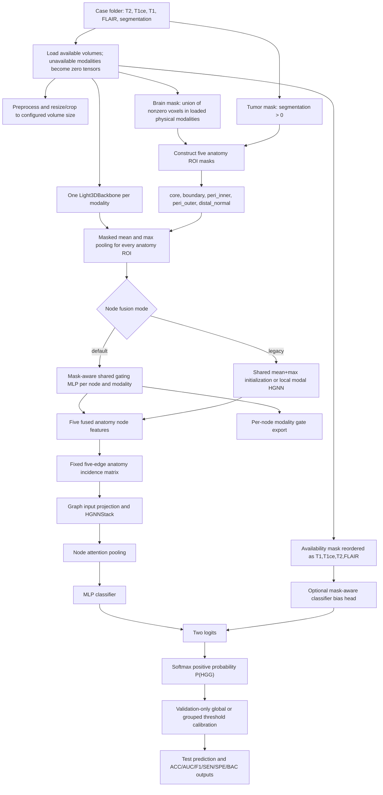

# Current Pipeline

> 中文摘要：当前主干是缺失多模态脑 MRI 的 HGG/LGG 二分类流程。它从分割构造 5 个固定解剖节点，经模态特征提取、缺失感知节点融合、固定解剖超图、注意力池化和分类头得到 `P(HGG)`，再使用仅由验证集拟合的全局或三组阈值完成测试评估。

## Scope and version

This document describes the code at `main` commit `2d87862` and separately notes the newer protocol code at `codex/safe-calibration-diagnostics` commit `1471a6b`. The latest real-data `protocol_v2_*` outputs were produced by the latter branch, not by the current `main` HEAD.

## Task definition

The project performs binary glioma-grade classification under arbitrary missing multi-modal brain MRI. Each case may contain `T2`, `T1ce`, `T1`, and `FLAIR`; the label loader maps LGG to `0` and HGG to `1`. The model outputs two logits and the positive-class probability `P(HGG)`. Evidence: `datasets/brats_dataset.py` (`ALL_MODALITIES`, label parsing, `BraTSCaseDataset.__getitem__`), `configs/default.yaml:data.modalities`, and `models/hybrid_hypergraph.py:HybridHypergraphClassifier.forward`.

The current research hypothesis is:

> Stable, segmentation-derived anatomy nodes provide a controlled relational backbone, while explicit missing-modality awareness should be handled at node-level fusion and decision calibration rather than by reintroducing prototype nodes or dynamic KNN topology.

## End-to-end flow

## Data and anatomy construction

`datasets/brats_dataset.py:build_acp_masks` builds five masks:

| Node index | Name | Current construction |
|---:|---|---|
| 0 | `core` | Deepest `q_core=0.4` fraction of tumor voxels according to the internal Euclidean distance transform. |
| 1 | `boundary` | Tumor mask minus `core`. |
| 2 | `peri_inner` | `dilate(tumor, r1=3) - tumor`. |
| 3 | `peri_outer` | `dilate(tumor, r2=7) - dilate(tumor, r1=3)`. |
| 4 | `distal_normal` | Estimated brain mask minus `dilate(tumor, r2=7)`. |

The brain mask is the union of nonzero voxels across every modality file physically present for the case. In `BraTSCaseDataset.__getitem__`, all files are loaded and the anatomy masks are built before the sampled combination is applied at lines 449-451. Therefore ROI masks are invariant across simulated combinations of a complete public case, but they indirectly use spatial support from modalities later declared missing. This is not label leakage, yet it makes simulated missingness less strict than physical modality absence. The segmentation mask is loaded independently and `seg > 0` defines tumor; the whole pipeline assumes segmentation is available at inference.

The fixed hyperedges in `models/hybrid_hypergraph.py:ANATOMY_HYPEREDGES` are:

| Edge | Node indices | Anatomical relation encoded by the comment |
|---|---|---|
| E1 | `[0, 1, 2]` | core + boundary + peri_inner |
| E2 | `[1, 2, 3]` | boundary + peri_inner + peri_outer |
| E3 | `[2, 3, 4]` | peri_inner + peri_outer + distal_normal |
| E4 | `[0, 2, 4]` | lesion-background contrast |
| E5 | `[0, 1, 2, 3]` | overall lesion-context region |

Prototype count is hard-coded to zero. Enabling prototype nodes or edges raises `ValueError`. `use_knn_edges` is hard-coded to `False`; the `knn` branch key remains only for API compatibility. The default uses the five anatomy nodes and five fixed edges (`configs/default.yaml:graph`).

## Feature extraction and fusion

For each modality, `Light3DBackbone` creates a feature map. `_masked_mean_max_pool` pools each ROI with both mean and maximum statistics, and `explicit_projector` maps the concatenation into the node feature space. Unavailable modalities are zeroed before fusion.

The default `_mask_aware_node_fuse` path uses one shared `modality_gate` MLP. Its inputs are the current modality-node feature, a learned embedding of the complete four-element availability mask, and, when enabled, a learned node-type embedding. It produces a separate modality score for each of the five anatomy nodes.

Unavailable scores are replaced by `-1e9` before softmax and multiplied by the availability mask after softmax, then renormalized. Thus their final weights are exactly zero up to the explicit arithmetic path. When `T1` is present and `T1ce` is absent, the configured scalar `fusion.no_t1ce_t1_penalty` is subtracted from every T1 score. It is a fixed configuration hyperparameter, not a learned value.

The real protocol-v2 gating exports confirm that the mechanism executed on real test cases:

| Combination | Global T1 | Global T2 | Global FLAIR | Interpretation |
|---|---:|---:|---:|---|
| `t2_t1` | 0.324 | 0.676 | 0.000 | T1 is below T2. |
| `t1_flair` | 0.186 | 0.000 | 0.814 | T1 is below FLAIR. |
| `t2_t1_flair` | 0.138 | 0.265 | 0.597 | T1 is below both on average. |

Evidence: `server_results/outputs/protocol_v2_curriculum_seed42/test/<combo>/gating_stats.csv`. These values prove execution, not superiority over an unpenalized or non-gated fusion baseline.

The non-default paths still present are:

- `fusion.use_mask_aware_node_fusion=false` and `branches.use_modal_edges=false`: shared mean+max modality initialization. This is not a pure arithmetic-average baseline.
- `fusion.use_mask_aware_node_fusion=false` and `branches.use_modal_edges=true`: a local modal HGNN followed by extraction of the shared node.
- `model.use_mask_aware_classifier=true`: an availability-mask MLP adds a bias to the logits. This is enabled by default and must be disabled when isolating node-fusion effects.

## Training, calibration, and testing data flow

```mermaid
flowchart LR
    A["Fixed seed-42 split: train 292"] --> B["Fit model with train-only class weights"]
    B --> C["Validation 36: checkpoint selection"]
    C --> D["Load selected checkpoint"]
    D --> E["Validation predictions over 15 modality combinations"]
    E --> F["Fit global or three grouped thresholds"]
    F --> G["Freeze thresholds"]
    G --> H["Test 37 over 15 modality combinations"]
    H --> I["Metrics, per-case predictions, gates, hashes"]
```

At `main`, class weights are computed by `utils/training.py:class_weights_from_records` from training records only and passed to `nn.CrossEntropyLoss` in `train.py`; BCE and focal loss are not implemented. The default is weighted cross-entropy.

Threshold calibration uses validation probabilities, not test labels. The current default is the three-way mode:

- `has_t1ce`: any combination containing T1ce;
- `no_t1ce_no_t1`: neither T1ce nor T1;
- `no_t1ce_with_t1`: T1 present and T1ce absent.

The old two-group dispatch (`has_t1ce` versus `no_t1ce`) remains for backward compatibility, while `configs/default.yaml` selects three groups. There is no current two-group fitting function in `train.py`; selecting an unrecognized non-three-group mode falls through to global calibration, so a two-group comparison needs a small restored/offline fitter rather than a YAML-only change. A three-way group falls back to the global threshold when it is too small or single-class. The main branch uses only the basic condition in `utils/metrics.py`; commit `1471a6b` adds bounded threshold search, tie-breaking, and explicit minimum sample/positive/negative constraints used by protocol-v2.

Protocol-v2 validation thresholds were `0.7205`, `0.3065`, and `0.3020`, with no fallback. The reported group sample counts are combination-expanded observations of the same 36 validation cases, not independent patients.

## Important implementation boundaries

- The current model is anatomy-only, but the top of `README.md` still describes the older seven-ROI, prototype, dynamic-KNN architecture. Current code, default configuration, and protocol-v2 outputs are the authoritative state.
- The latest real outputs require branch commit `1471a6b`; `main` lacks its joint checkpoint selection, hash audit, safe calibration constraints, tests, and protocol configs.
- `build_drop_t1_ablation_report` remaps already evaluated combinations and therefore applies each combination's own grouped threshold. It does not provide a same-threshold causal inference ablation.
- No true mean-only fusion baseline exists as a clean named path. The closest existing baseline is shared mean+max initialization.
- No cross-validation is implemented in the current protocol. Current real evidence is a single fixed seed-42 split.
- Simulated missingness zeros image tensors only after brain/anatomy masks have been derived from all physically present modalities. A real physically missing modality could provide less support unless a modality-independent brain mask is part of the deployment contract.
